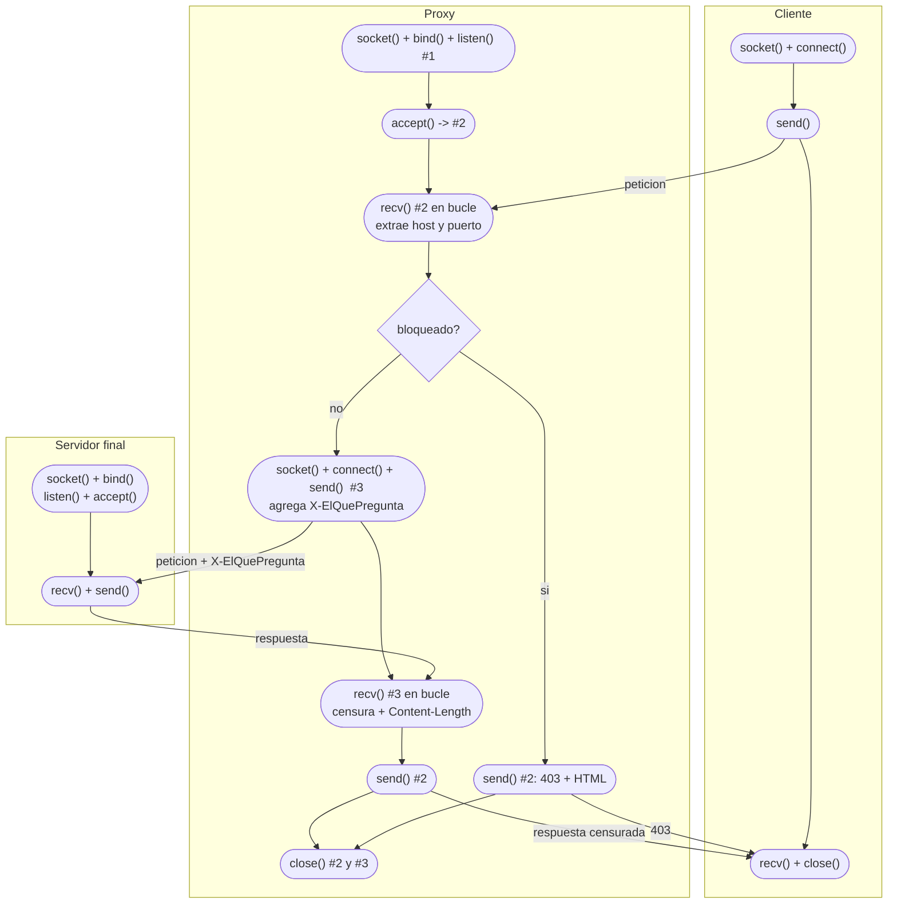

# Diagrama de flujo del proxy

Los numeros #1, #2 y #3 son los tres sockets del proxy:

- **#1 socket de escucha**: bind + listen, nunca transfiere datos, vive todo el programa
- **#2 socket con el cliente**: lo devuelve accept(), el proxy actua como servidor
- **#3 socket con el servidor final**: el proxy actua como cliente, se crea y cierra por cada peticion

Al cerrar #2 y #3 el proxy vuelve a accept() para atender al siguiente cliente.
